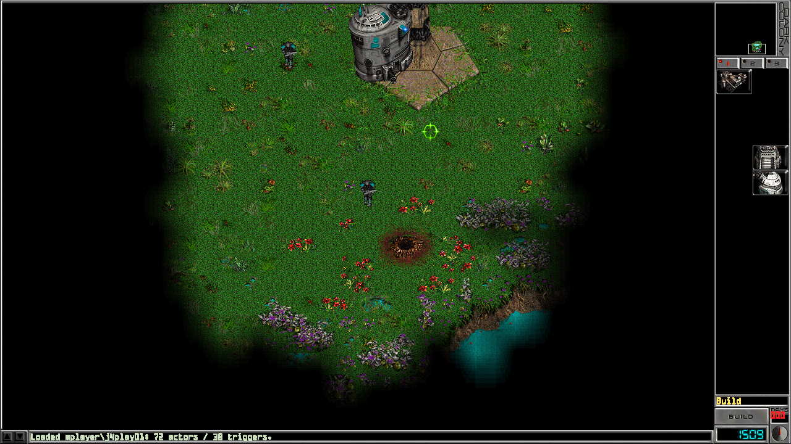
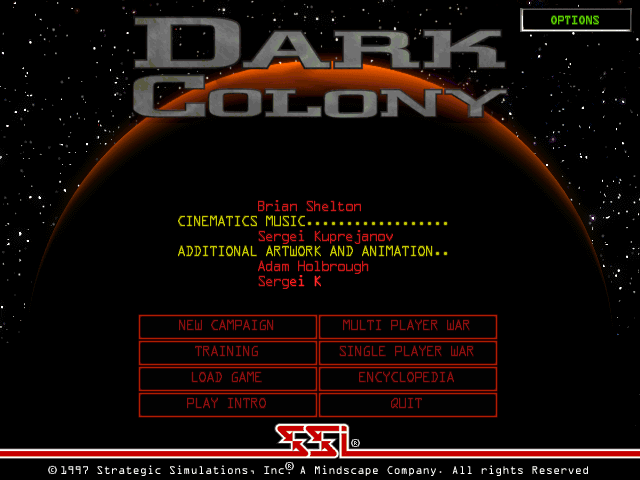
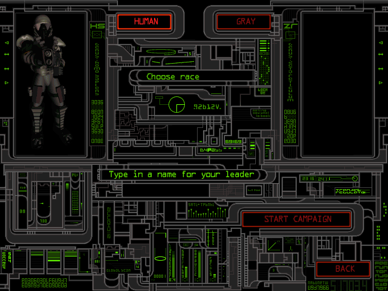
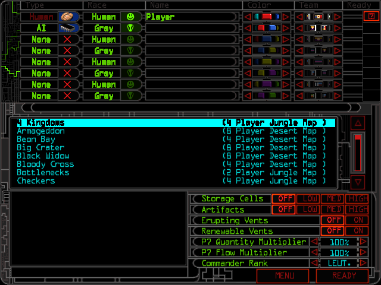
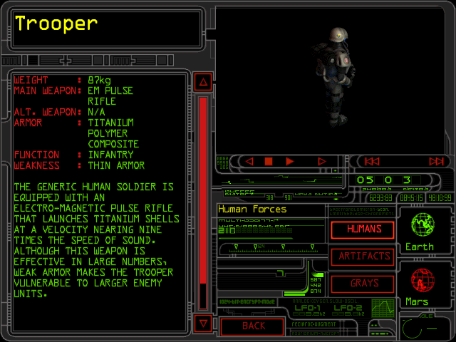
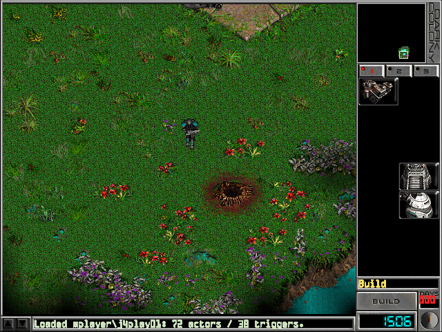
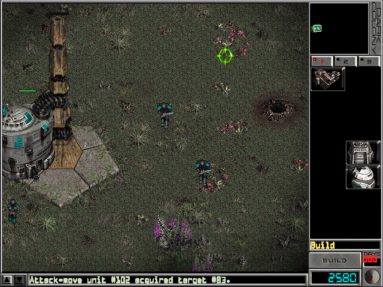
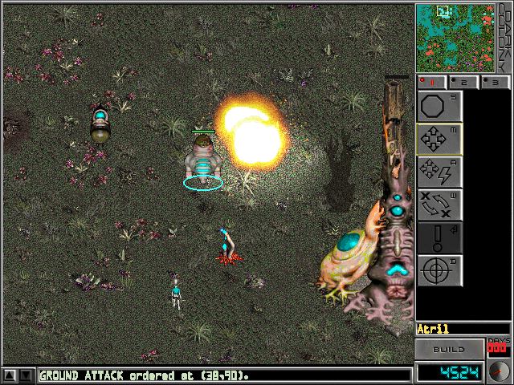
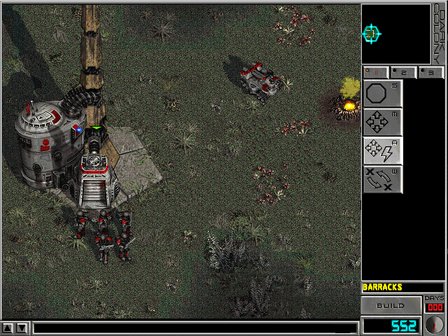
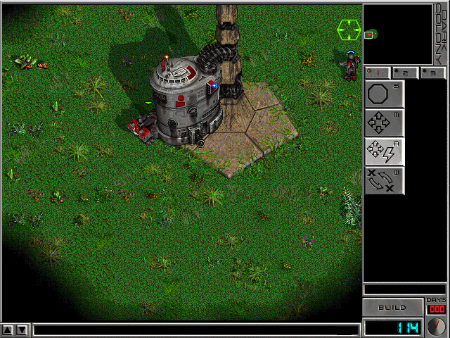

# Dark Colony .NET port

A clean-room reimplementation of **Dark Colony**, the 1997 real-time
strategy game published by Strategic Simulations, Inc., in C# on .NET 8 and
Direct3D 11. Its rules come from reading the original `dc.exe`, so units,
combat, the economy, the computer player and the mission scripts behave as
they do in the original.

It plays the Human and Gray campaigns, the training missions, and Single and
Multi Player War, with the original's music, videos and encyclopedia.

How it was made: [docs/HOW_THE_PORT_WAS_MADE.md](docs/HOW_THE_PORT_WAS_MADE.md).



## The original game's files

The port has no graphics, sounds, maps or game data of its own. It uses the
original game's, read at start-up from a copy of Dark Colony installed on the
player's disk:

- the sprites and animations, maps, scenarios, mission scripts, unit
  statistics and menu screens;
- `dc.exe` itself, for tables such as the random stream, the sight areas and
  the building footprints;
- from the CD, if it is there, the soundtrack and the videos.

Nothing is converted or copied: none of these files is in this repository,
and none may be added. The only pictures from the game here are the
screenshots below. To play, you need your own copy of the game; this
repository does not say where to get one.

The port looks for the installation in `--data <folder>`, then in the
`DARKCOLONY_DATA` variable, then in `..\Dark Colony` next to this repository.
The CD image (`DCUK.cue`/`.bin`) goes next to the installation.

## Differences from the original

The port aims to play exactly like the original. Where it does not, the
difference is one of the following.

### Rules changed on purpose

The author decided these while play-testing, where the original felt wrong:

- **Winning a War.** A player is out once the last building of its city
  falls, whatever units it has left. The original keeps a player in while
  any of its units lives ([war-session.md](docs/reverse-engineering/war-session.md)).
- **A building destroyed while its ship lowers it** frees the player's next
  delivery and its place in the city. In the original both stay blocked for
  the rest of the game ([production-flow.md](docs/reverse-engineering/production-flow.md)).
- The message strip says when a player is out of a War.

### Added by the port

None of these change how a game plays:

- **Display.** The original runs only at 640x480. The port can also run in a
  larger window or fullscreen, sharp at the monitor's DPI, with a larger
  gameplay view; network games keep 640x480. At window scale 1 with the
  classic view it draws the original's picture exactly ([DISPLAY.md](docs/DISPLAY.md)).
- **Options.** The main menu has an OPTIONS button in its top-right corner,
  and the in-game OPTIONS a VIDEO button. Both open the port's Video panel:
  - window or fullscreen, size, scaling, gameplay view, vsync and pointer
    lock;
  - the intro video on or off, and a frame counter;
  - MOUSE: the original buttons, or orders on the right button;
  - DEBUG GUIDES: markers over the world for vents, move paths, waypoints
    and attacked units.
- **Saves and replays.** A save records the game's commands and replays them
  up to the saved moment, so any save can also be watched as a replay. The
  original's own save files cannot be loaded ([SAVE_GAMES.md](docs/SAVE_GAMES.md)).
- **Multi Player War over TCP/IP** with the port's own lockstep protocol. The
  original used DirectPlay, so the port cannot play against it, and IPX,
  modem and serial are not offered ([NETWORK_AND_REPLAY.md](docs/NETWORK_AND_REPLAY.md)).
- **Diagnostics.**
  - F12 labels the units.
  - Ctrl+F12 (`--reveal-map`) lifts the fog.
  - Shift+F12 shows the path regions.
  - `--perf` logs frame timings ([PERFORMANCE.md](docs/PERFORMANCE.md)).
  - Each session writes a log to `%LOCALAPPDATA%\DarkColony.Port\logs\latest.log`.

### Not yet like the original

- **Fog of war.** The original keeps a marker for two kinds of objects on
  ground out of sight; the port does not draw it. A city building seen
  earlier shows as it stands now, not as the player last saw it
  ([vision.md](docs/reverse-engineering/vision.md)).
- **The end of a War** uses the campaign's debrief screen, not the
  original's results screen with each player's kills and losses.
- **Menus.**
  - The main menu builds itself up with the port's own timing.
  - Encyclopedia articles are laid out differently.
  - The network screens' animated decorations stand still.
- Smaller open items are in [docs/GAMEPLAY_FIXES_PLAN.md](docs/GAMEPLAY_FIXES_PLAN.md)
  and in each reverse-engineering note's status table.

## Screenshots

These are screenshots of the port, and of the original for comparison, taken
on the author's own copy of the game.

### The port

| | |
| --- | --- |
|  |  |
| Main menu | New campaign: choosing a race |
|  |  |
| Single Player War lobby | Encyclopedia |
|  |  |
| A War by day | The same base at night |
|  | |
| An explosion lights the ground at night | |

### The original and the port

The original pictures are captures of `dc16.exe`, the original's
16-bit-colour build, in a window. The scenes are alike, not identical.

| Original | Port |
| --- | --- |
|  |  |
| Night: grey ground, coloured units | The same rule, from `dc.exe`'s terrain pass ([day-night.md](docs/reverse-engineering/day-night.md)) |
|  |  |
| The explored ground fades into black over about a tile | The same fade, from the same pass ([vision.md](docs/reverse-engineering/vision.md)) |

## Requirements and running

- Windows 10 or later, and the [.NET 8 SDK](https://dotnet.microsoft.com/download/dotnet/8.0).
- An installed copy of the original game (see above).

| How | What it does |
| --- | --- |
| `run-debug.cmd [flags]` | Build and run in Debug |
| `run-display\*.cmd` | The same, with a display preset (fullscreen 1080p, 2x window, ...) |
| `run-war-lobby-debug.cmd` | Debug, straight to the Single Player War lobby |
| `run-release.cmd` | Run the Release build (make it first, below) |

To make the Release build, a self-contained folder that runs without the SDK:

```powershell
dotnet publish src\DarkColony.App -c Release -r win-x64 --self-contained true -o artifacts\DarkColony-win-x64
```

## Playing

The original controls are the default: the left button selects and gives
orders, and the right button deselects.

| Key | Action |
| --- | --- |
| Space | BUILD (sends the counted troops, buildings and research) |
| S, M, A, W | Stop, Move, Move & Attack, Waypoint |
| Enter | The selected unit's special |
| F1-F10 | Select the on-screen units of one type (Shift toggles, Ctrl ground only, Alt air only) |
| Arrows, screen edges, minimap | Scroll |
| Esc, Q | Cancel, then "REALLY QUIT?" |
| Alt+Enter | Window ↔ fullscreen |
| F10 (main menu), VIDEO (in-game OPTIONS) | Video panel |

## Verify

```powershell
dotnet build DarkColony.Port.sln                        # zero warnings
dotnet run --project tests/DarkColony.Engine.Checks     # all checks, about 35 s
dotnet run --project tests/DarkColony.Engine.Checks -- --tag fast   # no installation needed
```

The checks include determinism goldens: scripted games hashed every update.
See [docs/TESTING.md](docs/TESTING.md). `tools/Run-Port.ps1` runs the app
unattended, posts input and captures the window.

## Layout

```text
src/DarkColony.Engine         simulation and original-data readers (no UI, deterministic)
src/DarkColony.Presentation   display layout, settings, HUD anchoring (platform-free)
src/DarkColony.App            Windows host: Direct3D 11, input, audio, video, screens
tests/DarkColony.Engine.Checks   the check runner (dependency-free)
tools/                        PowerShell: unattended runs, posted input, live tests
run-display/                  one-click display presets
docs/                         design, testing, reverse-engineering notes (docs/README.md)
```

Rules for contributors (and coding agents) are in [AGENTS.md](AGENTS.md) and
[docs/PORT_CONTRACT.md](docs/PORT_CONTRACT.md).
