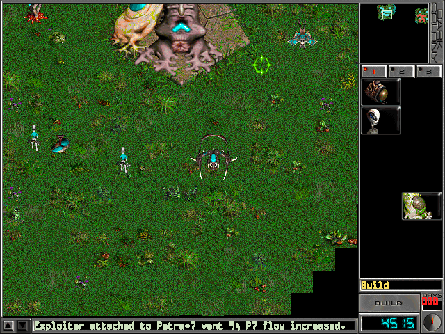
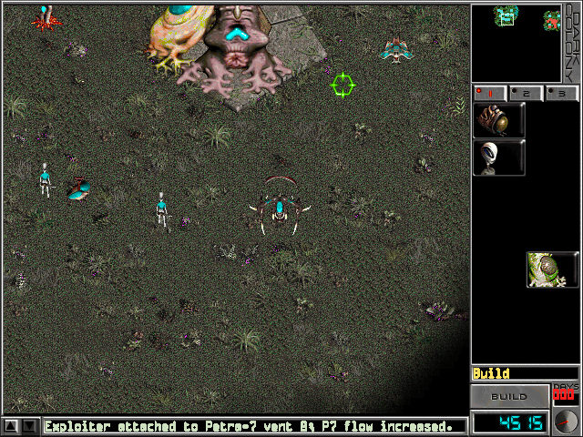
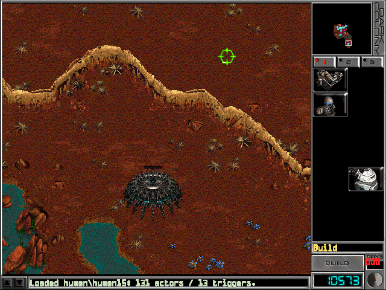
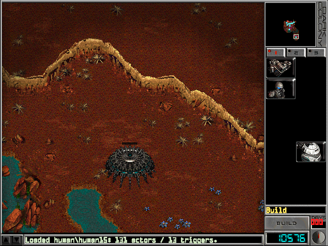
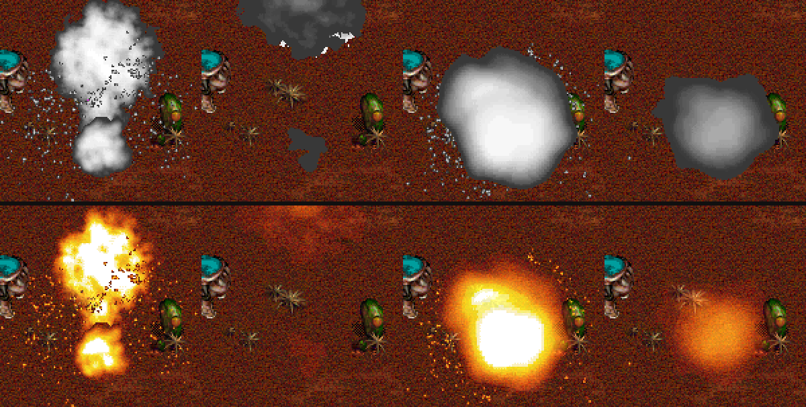
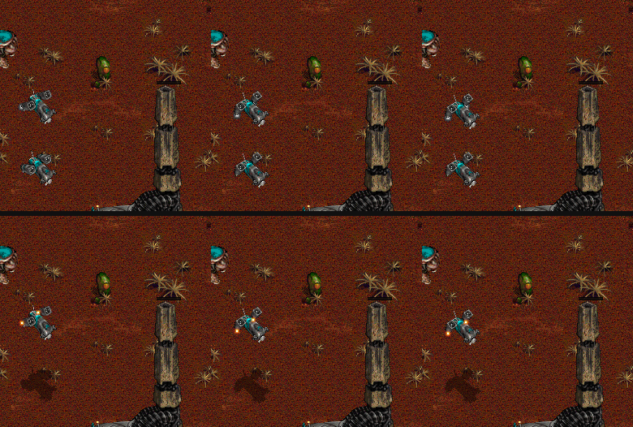
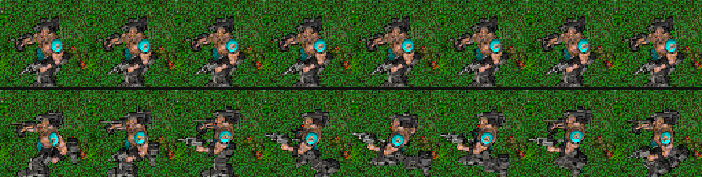

# How the port was made

Dark Colony is a 1997 Windows RTS. Its source code was never released. This
port rebuilds the game from two things: the shipped data files and the
machine code of the original executable. It reads both from the player's own
installation at runtime. The aim is the original's behaviour, rule by rule,
not a look-alike.

## The material

| What | Where it comes from |
| --- | --- |
| Rules: movement, combat, economy, AI, missions, vision | `dc.exe`, read as x86 machine code |
| A runnable original for comparison | `dc16.exe`, the 16-bit-colour build, run with cnc-ddraw against a mounted copy of the CD |
| Sprites and animations | SPR frames and FIN layer definitions |
| Maps | MAP/BTS terrain, PTH path regions, SCN placements, TRO mission scripts, MTG trigger zones |
| Statistics and build tree | the `gamestat` text tables (`depend.txt` and others) |
| Screens | `intrface` screen definitions and GIF backgrounds |
| Music and video | the CD's audio tracks and Cinepak AVIs |

The CD image matters for a practical reason. The game checks that its disc is
read-only: if it can write to the disc, it locks Single Player War. A mounted
ISO passes that check.

## Stages

**1. Research viewer (July 2026).** This work lives in the sibling folder
`../dc-port-26`, which is not in this repository. It holds:

- Python readers for every file format, each with tests, and an inventory of
  the installation;
- a browser viewer for sprites, maps, scenarios, scripts and the 640x480
  screens;
- disassembly helpers built on Capstone, plus a Ghidra project, for reading
  `dc.exe`.

The stage ended with a hand-off document, the compiled-engine reconstruction
plan. It fixed the coordinate spaces, the fixed step, and what counts as
evidence. That plan became [PORT_CONTRACT.md](PORT_CONTRACT.md).

**2. Compiled scaffold (August 2026).** The work moved here, to a .NET 8
solution, with three parts:

- an engine with no UI;
- a WinForms host drawing through Direct3D 11 (Vortice);
- a check runner.

The menus and the War lobby were rebuilt control by control from the screen
definitions and from captures of the original. One large commit brought in
combat, specials, production and the HUD. All drawing then moved to GPU
commands.

**3. The roadmap (3-4 October 2026).** Nine goals were worked in order. The
brief is [history/AUTONOMOUS_ROADMAP_PROMPT.md](history/AUTONOMOUS_ROADMAP_PROMPT.md).

0. Restore the toolchain and commit the pending work.
1. **A safety net first.** `SimulationDigest` hashes the whole simulation
   state every update, and scripted games are compared with recorded goldens
   ([DETERMINISM.md](DETERMINISM.md)).
2. Split the two very large files (`ScenarioSimulation`, `MainForm`) into
   subsystem partial files with identical hashes. The local pathfinder got
   12 times faster, with the same results.
3. Close the game loop:
   - target acquisition;
   - player cities and Petra-7 income;
   - troop queues;
   - blocked steps.
4. Mission scripts. `.tro` files are compiled and run as `dc.exe` does.
5. The campaign: briefing, mission, debrief, next mission. A headless smoke
   test drives all 44 campaign and training missions to an outcome. Saves are
   command journals.
6. The computer player. The executable's "Krusty" planner was ported module
   by module ([reverse-engineering/computer-player.md](reverse-engineering/computer-player.md)).
7. Polish: CD music, Cinepak video, the encyclopedia, credits, in-game options.
8. Replays and lockstep networking, then Multi Player War over TCP/IP.

After the roadmap came the test suite: a catalog sweep that builds, trains,
researches and fights with every item of both races, a parallel runner, and
live tests that drive the real app.

**4. Display and play-testing (4-6 October 2026).** Two parts:

- Display modes: native DPI, fullscreen, larger gameplay views, and the Video
  panel ([history/DISPLAY_MODES_PLAN.md](history/DISPLAY_MODES_PLAN.md)).
- The author played the port and reported what felt wrong. Each report became
  a row in [GAMEPLAY_FIXES_PLAN.md](GAMEPLAY_FIXES_PLAN.md),
  was traced in `dc.exe`, and was fixed in its own commit. Fixes include:
  - the build catalog's counts and BUILD button;
  - buildings lowered by drop ship;
  - the Barrage's shells;
  - Napalm burning;
  - the War victory rule;
  - menus driven by the original screen definitions, with their build-up
    animations and sounds;
  - translucent explosions and shadows through the tileset's blend tables;
  - the fog of war's shading;
  - day and night;
  - walk animations facing the right way.

  A performance pass made late games smooth at 1920x1080 ([PERFORMANCE.md](PERFORMANCE.md)).
  Some of these fixes are shown below, before and after.

## Some fixes, before and after

Each pair comes from the same saved game or the same animation frames. The
saved-game pairs were captured twice: once with a worktree of the commit
before the fix, and once with the fixed build. The numbers are rows of
[GAMEPLAY_FIXES_PLAN.md](GAMEPLAY_FIXES_PLAN.md).

**Fog of war and night** (items 26 and 29). Before, unexplored ground was cut
out in black squares and the night did not show. After, the ground fades
into black, and the night greys it.

| Before | After |
| --- | --- |
|  |  |

**Ground out of sight** (item 26). Before, ground the player had explored
stayed fully lit. After, ground outside every unit's sight darkens to 10/16,
as the original shades it.

| Before | After |
| --- | --- |
|  |  |

**Explosions** (item 23). Two FIN draw types read blend tables from the
tileset's `.rmp` instead of covering the ground. They were drawn as grey and
white blobs (top); now they glow over the ground (bottom).

**A VTOL leaving the factory** (item 25). The last frames of its build
animation hold the craft and its shadow, which the port drew as a second
VTOL (top). Draw type 2 is a shadow that darkens the ground (bottom).

**The Sarge's walk** (item 27). A table that turns a unit's facing into an
animation had been misread, so a Sarge walking west showed a one-frame
turning pose and slid (top). With the executable's values it walks (bottom).

## How one rule gets in

1. **Find it in `dc.exe`.** Assertion strings name the original source files
   (`ai.c`, `krusty_attack.c`, `avi.c`), which helps locate routines. Data
   references and call graphs lead the rest of the way.
2. **Write it down.** Each rule goes in a note under
   [reverse-engineering/](reverse-engineering/), with addresses and a status:
   - executable-confirmed;
   - data-derived;
   - observed;
   - provisional;
   - unresolved.
3. **Implement it in the engine.** Tables are read from the player's
   `dc.exe` at runtime through `PeImage` rather than copied. Examples are the
   random stream, the sight trees, the target rings and the footprints. Only
   short constants appear in code, with their address beside them.
4. **Check it.** Every format and rule has a check. The goldens change only
   when behaviour is meant to change, and the commit says why.
5. **Compare it with the original** where static reading is not enough:
   - side-by-side screenshots;
   - the debugger (`cdb`) attached to a running `dc16.exe` to read live state;
   - a worktree of an older commit, run on the same saved game, to show a
     fix before and after.

   When no evidence can settle a question, such as how the game should feel,
   the author decides. Those decisions are recorded with the rule:
   - the original mouse buttons are the default;
   - units outside sight are hidden;
   - a building destroyed during delivery frees its slot, which the original
     does not;
   - a War is lost with the last building, where the original also counts
     units.

## Design choices that made it work

- **Determinism.** The original's rules are kept exactly:
  - a strict 66 ms fixed step;
  - 8.8 fixed-point positions;
  - no floating-point trigonometry (the bearing tables are rebuilt from
    exact decimal series);
  - the original's single random stream, drawn in the original order.

  Saves, replays, desync detection and network lockstep all follow from that
  one property.
- **One engine for both races.** Humans and Grays differ in data and in a few
  recovered flags, not in parallel class hierarchies.
- **Rendering reads, never writes.** The app interpolates between simulation
  states and turns input into commands for the next update. Display features
  therefore cannot change a game: the goldens stayed the same through the
  display and performance work.
- **No assets in git.** `.gitignore` blocks the original formats, and every
  reader takes the installation path.

## Who did the work

The code and notes were written by AI coding agents, directed by the
repository's author. The author supplied the original game and the CD,
play-tested, and made the calls evidence could not.
[AGENTS.md](../AGENTS.md) is the agents' standing brief.

Wrong guesses were corrected as evidence arrived. Some examples:

- The SCN team fields are labelled *after* their values, so early readings
  were shifted by one field.
- The movement class is gamestat value 13, not the armour class.
- Sprites, path regions and terrain were first placed in different frames.
- The port was once said to have fog of war, when it only blacked out
  unexplored ground.
- The table that picks an animation for a facing (`0x47950C`) was read as
  `3, -2, 3, -2 ...` instead of `0, 1, -1, 2, -2 ...`. Units with 16
  directions were drawn turned by one, and the Sarge slid while walking.
- A FIN draw type was taken for a sprite when it is a shadow, so a VTOL
  leaving the factory looked like two.

Older notes stay in [history/](history/) as a record. Where they disagree with
the code or with `reverse-engineering/`, the code and those notes win.

## In numbers (6 October 2026)

| Part | Size |
| --- | --- |
| History | 182 commits, 1 August to 6 October 2026 |
| Engine | about 17,600 lines |
| App | about 10,800 lines |
| Presentation | about 1,000 lines |
| Checks | about 8,300 lines; 224 checks, determinism goldens over installed scenarios |
| Reverse-engineering notes | 22 |
| Play-testing reports | 29; one (item 11) waits for a way to reproduce it |
| Scenarios | all 101 installed load; the 44 campaign and training missions reach an outcome headless |
